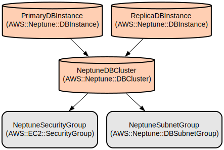

# AWS SSO Access Analysis and Graph Database Tool

A comprehensive tool for analyzing AWS Single Sign-On (SSO) access patterns using Amazon Neptune graph database. This solution helps identify potential security risks, toxic access combinations, and provides detailed access reports for users and organizations.

The tool collects data from AWS SSO, AWS Identity Store, and AWS Organizations to build a graph representation of user access patterns. It analyzes cross-environment access, administrative privileges, and extensive account access patterns to identify potential security risks. The solution generates detailed HTML reports that provide insights into user access patterns and potential security concerns.

## Repository Structure
```
.
├── devfile.yaml              # Development environment configuration
├── docs/                     # Documentation files including infrastructure diagrams
├── g_collect.py             # AWS SSO data collection script
├── generate_report.py       # HTML report generation for user access analysis
├── import_json_data.py      # S3 to Neptune data import utility
├── neptune_connection.py    # Neptune database connection utilities
├── neptune_utils.py         # Shared Neptune utility functions
├── neptune.yaml            # CloudFormation template for Neptune infrastructure
├── requirements.txt        # Python package dependencies
└── toxic.py               # Toxic access combinations analysis script
```

## Usage Instructions
### Prerequisites
- AWS Account with SSO enabled
- Python 3.7 or higher
- AWS CLI configured with appropriate permissions
- Amazon Neptune cluster (can be deployed using provided CloudFormation template)
- IAM permissions for:
  - AWS SSO
  - AWS Organizations
  - Amazon Neptune
  - Amazon S3

### Installation
```bash
# Clone the repository
git clone <repository-url>
cd <repository-name>

# Install dependencies
pip install -r requirements.txt

# Configure AWS credentials
aws configure
```

### Quick Start
1. Deploy Neptune infrastructure:
```bash
aws cloudformation deploy --template-file neptune.yaml \
    --stack-name sso-analysis \
    --parameter-overrides Environment=dev \
    --capabilities CAPABILITY_IAM
```

2. Collect AWS SSO data:
```bash
python g_collect.py --region us-east-1
```

3. Import data to Neptune:
```bash
python import_json_data.py \
    --neptune-endpoint <your-neptune-endpoint> \
    --region us-east-1
```

4. Generate access analysis report:
```bash
python generate_report.py \
    --neptune-endpoint <your-neptune-endpoint> \
    --email user@example.com
```

### More Detailed Examples
1. Analyze toxic access combinations:
```bash
python toxic.py \
    --neptune-endpoint <your-neptune-endpoint> \
    --region us-east-1 \
    --output-dir reports
```

2. Generate organization-wide report:
```bash
python generate_report.py \
    --neptune-endpoint <your-neptune-endpoint> \
    --org-report
```

### Troubleshooting
1. Neptune Connection Issues
- Error: "Failed to connect to Neptune"
  ```bash
  # Verify security group settings
  aws ec2 describe-security-groups --group-ids <security-group-id>
  
  # Check Neptune status
  aws neptune describe-db-clusters --db-cluster-identifier <cluster-id>
  ```

2. Data Import Failures
- Error: "S3 access denied"
  ```bash
  # Verify IAM permissions
  aws iam get-role --role-name <role-name>
  
  # Check S3 bucket permissions
  aws s3api get-bucket-policy --bucket <bucket-name>
  ```

## Data Flow
The tool follows a three-stage process: collection, analysis, and reporting. It collects AWS SSO data, transforms it into a graph structure, and generates security analysis reports.

```ascii
AWS Services         Graph Database            Analysis & Reporting
+------------+      +--------------+          +------------------+
|   AWS SSO  |      |              |          |   User Access    |
|  Identity  |----->|   Neptune    |--------->|     Report       |
|    Store   |      |   Database   |          |                  |
+------------+      |              |          |   Toxic Access   |
|    AWS     |----->|  (Vertices   |--------->|    Analysis     |
|   Orgs    |      |   & Edges)   |          |                  |
+------------+      +--------------+          +------------------+
```

Component interactions:
1. AWS SSO data is collected using boto3 API calls
2. Data is transformed into vertices and edges
3. Graph data is loaded into Neptune using Gremlin
4. Analysis queries are executed using Gremlin traversals
5. Results are processed and formatted into HTML reports
6. Reports are generated with detailed security findings
7. Error handling and logging throughout the pipeline

## Infrastructure


### Neptune Database
- DBCluster (AWS::Neptune::DBCluster)
  - Identifier: db-neptune-1
  - Engine Version: 1.4.3.0
  - IAM Authentication: Enabled
  - Encryption: KMS
  - Logging: Audit and Slow Query logs

### Network Resources
- SecurityGroup (AWS::EC2::SecurityGroup)
  - Purpose: Neptune cluster access control
  - Inbound: TCP 8182 from VPC CIDR
- DBSubnetGroup (AWS::Neptune::DBSubnetGroup)
  - Purpose: Multi-AZ subnet configuration

### Database Instances
- Primary Instance (AWS::Neptune::DBInstance)
  - Class: Configurable (default: db.r6g.large)
  - High Availability: Single AZ
- Replica Instance (AWS::Neptune::DBInstance)
  - Conditional: Created only in production
  - Class: Matches primary instance

## Deployment
### Prerequisites
- VPC with at least two private subnets
- KMS key for encryption
- IAM roles and permissions

### Deployment Steps
1. Configure parameters in neptune.yaml
2. Deploy CloudFormation stack:
```bash
aws cloudformation deploy \
    --template-file neptune.yaml \
    --stack-name neptune-sso-analysis \
    --parameter-overrides \
        Environment=prod \
        DBInstanceClass=db.r6g.xlarge \
    --capabilities CAPABILITY_IAM
```

3. Configure environment variables:
```bash
export NEPTUNE_ENDPOINT=$(aws cloudformation describe-stacks \
    --stack-name neptune-sso-analysis \
    --query 'Stacks[0].Outputs[?OutputKey==`ClusterEndpoint`].OutputValue' \
    --output text)
```