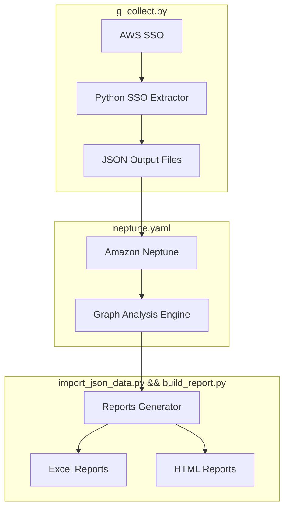

# AWS SSO Access Matrix Generator

A comprehensive solution for analyzing and visualizing AWS SSO permissions and access patterns across your organization.

## Architecture Diagram



## Project Overview

This project provides a solution for extracting, analyzing, and reporting AWS SSO access patterns across your organization. It consists of three main components:

1. **SSO Data Extractor**: Python script to collect SSO configuration data (Must run in the account where SSO is, works with cloudshell)
2. **Graph Database**: Amazon Neptune instance for storing and querying relationships.
3. **Analysis & Reporting**: Generation of detailed access reports in HTML and Excel formats.

## Prerequisites

- Python 3.10+
- AWS CLI configured with appropriate permissions
- Access to AWS SSO
- Amazon Neptune instance
- Required Python packages:
  ```
  boto3
  pandas
  plotly
  gremlin-python
  xlsxwriter
  ```

## Setup Instructions

1. **Configure AWS Credentials**
   ```bash
   aws configure
   ```

2. **Deploy Neptune Database**
   - Create a Neptune cluster (manual setup for now, CloudFormation template coming soon)
   - Note the endpoint URL
   - Configure security groups and IAM roles

3. **Install Required Packages**
   ```bash
   pip install -r requirements.txt
   ```

## Usage

### 1. Extract SSO Data
```bash
python sso_extractor.py
```
This will generate JSON files containing:
- User information
- Group memberships
- Permission sets
- Account assignments

Sample `edges.json` :
```json
  {
    "from": "USER_44c834d8-60d1-xxxx-fd5e-12865077a5ba",
    "to": "GROUP_040894c8-c021-xxxx-365e-420a9fcf9dd7",
    "label": "MEMBER_OF",
    "properties": {
      "timestamp": "2025-02-25T01:03:53.255730"
    }
```

Vertices : 

```json
[
  {
    "id": "USER_040814e8-1001-xxxx-66c0-49f9a03681b1",
    "label": "User",
    "properties": {
      "userId": "040814e8-1001-xxxx-66c0-49f9a03681b1",
      "userName": "nobody.noone@example.com",
      "email": "nobody.noone@example.com",
      "type": "USER"
    }
  },
```

### 2. Load Data into Neptune
The data loading process is currently manual. Future versions will include automated loading.

### 3. Generate Reports
```bash
python generate_reports.py
```

## Output

The system generates two types of reports:

1. **HTML Report** containing:
   - Executive summary
   - Environment access analysis
   - Group analysis
   - Access matrix visualization

2. **Excel Report** with sheets for:
   - Summary metrics
   - Full environment access
   - Environment access distribution
   - Group statistics
   - Access matrix details

## Project Structure

```
/
├─ build_report.py
├─ g_collect.py
├─ import_json_data.py
├─ requirements.txt
└─ README.md
```

## Library dependency :
```python
aenum==3.1.15
aiobotocore==2.19.0
aiofiles==22.1.0
aiohappyeyeballs @ file:///home/conda/feedstock_root/build_artifacts/aiohappyeyeballs_1739175731979/work
aiohttp==3.8.1
aioitertools @ file:///home/conda/feedstock_root/build_artifacts/aioitertools_1735329051909/work
aiosignal @ file:///home/conda/feedstock_root/build_artifacts/aiosignal_1734342155601/work
aiosqlite==0.21.0
annotated-types==0.7.0
antlr4-python3-runtime==4.9.3
anyio @ file:///home/conda/feedstock_root/build_artifacts/anyio_1736174388474/work
argon2-cffi @ file:///home/conda/feedstock_root/build_artifacts/argon2-cffi_1733311059102/work
argon2-cffi-bindings @ file:///home/conda/feedstock_root/build_artifacts/argon2-cffi-bindings_1725356557095/work
arrow @ file:///home/conda/feedstock_root/build_artifacts/arrow_1733584251875/work
astroid==3.3.8
asttokens @ file:///home/conda/feedstock_root/build_artifacts/asttokens_1733250440834/work
async-lru @ file:///home/conda/feedstock_root/build_artifacts/async-lru_1733584297267/work
async-timeout==4.0.3
attrs==23.2.0
autopep8==2.0.4
autovizwidget @ file:///home/conda/feedstock_root/build_artifacts/autovizwidget_1736983369505/work
awscli==1.37.23
awswrangler==3.11.0
babel @ file:///home/conda/feedstock_root/build_artifacts/babel_1738490167835/work
backcall==0.2.0
beautifulsoup4 @ file:///home/conda/feedstock_root/build_artifacts/beautifulsoup4_1738740337718/work
bleach @ file:///home/conda/feedstock_root/build_artifacts/bld/rattler-build_bleach_1737382993/work
boto3==1.36.23
botocore @ file:///home/conda/feedstock_root/build_artifacts/botocore_1740216068872/work
Brotli @ file:///home/conda/feedstock_root/build_artifacts/brotli-split_1725267488082/work
cached-property @ file:///home/conda/feedstock_root/build_artifacts/cached_property_1615209429212/work
certifi @ file:///home/conda/feedstock_root/build_artifacts/certifi_1739515848642/work/certifi
cffi @ file:///home/conda/feedstock_root/build_artifacts/cffi_1725560520483/work
charset-normalizer==2.1.1
click==8.1.8
cloudpickle==3.1.1
colorama==0.4.6
comm @ file:///home/conda/feedstock_root/build_artifacts/comm_1733502965406/work
cryptography @ file:///home/conda/feedstock_root/build_artifacts/cryptography-split_1672672382195/work
Cython @ file:///home/conda/feedstock_root/build_artifacts/cython_1739227941089/work
debugpy @ file:///home/conda/feedstock_root/build_artifacts/debugpy_1737269734548/work
decorator @ file:///home/conda/feedstock_root/build_artifacts/decorator_1733236420667/work
defusedxml @ file:///home/conda/feedstock_root/build_artifacts/defusedxml_1615232257335/work
dill==0.3.9
docker==7.1.0
docstring-to-markdown==0.15
docutils==0.16
entrypoints @ file:///home/conda/feedstock_root/build_artifacts/entrypoints_1733327148154/work
environment-kernels==1.2.0
et_xmlfile==2.0.0
exceptiongroup @ file:///home/conda/feedstock_root/build_artifacts/exceptiongroup_1733208806608/work
executing @ file:///home/conda/feedstock_root/build_artifacts/executing_1733569351617/work
fastapi==0.115.8
fastjsonschema @ file:///home/conda/feedstock_root/build_artifacts/python-fastjsonschema_1733235979760/work/dist
fqdn @ file:///home/conda/feedstock_root/build_artifacts/fqdn_1733327382592/work/dist
frozenlist @ file:///home/conda/feedstock_root/build_artifacts/frozenlist_1737645236190/work
fsspec @ file:///home/conda/feedstock_root/build_artifacts/fsspec_1738501244951/work
gitdb==4.0.12
GitPython==3.1.44
google-pasta==0.2.0
graph-notebook==4.6.2
gremlinpython==3.6.2
gssapi==1.9.0
h11 @ file:///home/conda/feedstock_root/build_artifacts/h11_1733327467879/work
h2 @ file:///home/conda/feedstock_root/build_artifacts/h2_1738578511449/work
hdijupyterutils @ file:///home/conda/feedstock_root/build_artifacts/hdijupyterutils_1736983344385/work
hpack @ file:///home/conda/feedstock_root/build_artifacts/hpack_1737618293087/work
httpcore @ file:///home/conda/feedstock_root/build_artifacts/bld/rattler-build_httpcore_1731707562/work
httpx @ file:///home/conda/feedstock_root/build_artifacts/httpx_1733663348460/work
hyperframe @ file:///home/conda/feedstock_root/build_artifacts/hyperframe_1737618333194/work
idna @ file:///home/conda/feedstock_root/build_artifacts/idna_1733211830134/work
importlib-metadata==6.11.0
importlib_resources @ file:///home/conda/feedstock_root/build_artifacts/importlib_resources_1736252299705/work
ipyfilechooser==0.6.0
ipykernel==5.3.4
ipython==8.10.0
ipython_genutils @ file:///home/conda/feedstock_root/build_artifacts/ipython_genutils_1733399582966/work
ipywidgets==7.7.2
isodate==0.6.1
isoduration @ file:///home/conda/feedstock_root/build_artifacts/isoduration_1733493628631/work/dist
isort==6.0.0
itables==2.1.0
jedi==0.18.2
Jinja2==3.1.4
jmespath @ file:///home/conda/feedstock_root/build_artifacts/jmespath_1733229141657/work
json5 @ file:///home/conda/feedstock_root/build_artifacts/json5_1733272076743/work
json_repair==0.29.2
jsonpointer @ file:///home/conda/feedstock_root/build_artifacts/jsonpointer_1725302897999/work
jsonschema @ file:///home/conda/feedstock_root/build_artifacts/jsonschema_1733472696581/work
jsonschema-specifications @ file:///tmp/tmpk0f344m9/src
jupyter==1.0.0
jupyter-console==6.4.0
jupyter-events @ file:///home/conda/feedstock_root/build_artifacts/bld/rattler-build_jupyter_events_1738765986/work
jupyter-highlight-selected-word==0.2.0
jupyter-lsp @ file:///home/conda/feedstock_root/build_artifacts/jupyter-lsp-meta_1733492907176/work/jupyter-lsp
jupyter-server-mathjax==0.2.6
jupyter-server-proxy @ git+https://github.com/jupyterhub/jupyter-server-proxy@2d7dd346bb595106b417476de870a348943f3c70
jupyter-ydoc==0.2.5
jupyter_client==7.4.9
jupyter_contrib_core==0.4.2
jupyter_contrib_nbextensions==0.7.0
jupyter_core==5.3.2
jupyter_nbextensions_configurator==0.6.4
jupyter_server==2.7.3
jupyter_server_fileid==0.9.3
jupyter_server_terminals @ file:///home/conda/feedstock_root/build_artifacts/jupyter_server_terminals_1733427956852/work
jupyter_server_ydoc==0.8.0
jupyterlab==3.6.8
jupyterlab-git==0.41.0
jupyterlab-lsp==4.3.0
jupyterlab-widgets==1.1.1
jupyterlab_pygments @ file:///home/conda/feedstock_root/build_artifacts/jupyterlab_pygments_1733328101776/work
jupyterlab_server @ file:///home/conda/feedstock_root/build_artifacts/jupyterlab_server_1733599573484/work
krb5==0.7.0
lxml==5.3.1
markdown-it-py==3.0.0
MarkupSafe @ file:///home/conda/feedstock_root/build_artifacts/markupsafe_1733219680183/work
matplotlib-inline @ file:///home/conda/feedstock_root/build_artifacts/matplotlib-inline_1733416936468/work
mccabe==0.7.0
mdurl==0.1.2
mistune @ file:///home/conda/feedstock_root/build_artifacts/mistune_1675771498296/work
mock==4.0.3
multidict @ file:///home/conda/feedstock_root/build_artifacts/multidict_1733913043842/work
multiprocess==0.70.17
narwhals @ file:///home/conda/feedstock_root/build_artifacts/narwhals_1739851660861/work
nb_conda @ file:///home/conda/feedstock_root/build_artifacts/nb_conda_1735314771116/work
nb_conda_kernels @ file:///home/conda/feedstock_root/build_artifacts/nb_conda_kernels_1708439411368/work
nbclassic @ file:///home/conda/feedstock_root/build_artifacts/nbclassic_1675369808718/work
nbclient==0.7.0
nbconvert==7.2.8
nbdime==3.2.1
nbexamples @ file:///opt/nbexamples
nbformat @ file:///home/conda/feedstock_root/build_artifacts/nbformat_1733402752141/work
neo4j==5.23.1
nest_asyncio @ file:///home/conda/feedstock_root/build_artifacts/nest-asyncio_1733325553580/work
networkx==2.4
notebook==6.4.12
notebook_shim @ file:///home/conda/feedstock_root/build_artifacts/notebook-shim_1733408315203/work
numpy==1.23.5
omegaconf==2.3.0
openpyxl==3.1.5
overrides @ file:///home/conda/feedstock_root/build_artifacts/overrides_1734587627321/work
packaging @ file:///home/conda/feedstock_root/build_artifacts/packaging_1733203243479/work
pandas==2.2.2
pandocfilters @ file:///home/conda/feedstock_root/build_artifacts/pandocfilters_1631603243851/work
parso @ file:///home/conda/feedstock_root/build_artifacts/parso_1733271261340/work
pathos==0.3.3
pexpect @ file:///home/conda/feedstock_root/build_artifacts/pexpect_1733301927746/work
pickleshare @ file:///home/conda/feedstock_root/build_artifacts/pickleshare_1733327343728/work
pid==3.0.4
pkgutil_resolve_name @ file:///home/conda/feedstock_root/build_artifacts/pkgutil-resolve-name_1733344503739/work
platformdirs @ file:///home/conda/feedstock_root/build_artifacts/platformdirs_1733232627818/work
plotly @ file:///home/conda/feedstock_root/build_artifacts/plotly_1738287743623/work
pluggy==1.5.0
pox==0.3.5
ppft==1.7.6.9
prometheus_client @ file:///home/conda/feedstock_root/build_artifacts/prometheus_client_1733327310477/work
prompt_toolkit @ file:///home/conda/feedstock_root/build_artifacts/prompt-toolkit_1737453357274/work
propcache @ file:///home/conda/feedstock_root/build_artifacts/propcache_1737635528546/work
protobuf @ file:///home/conda/feedstock_root/build_artifacts/protobuf_1731365437114/work/bazel-bin/python/dist/protobuf-5.28.3-cp310-abi3-linux_x86_64.whl#sha256=1a22bd966bf84a4610fd6a1624465b3b8c18b8fa7a0834dcd09b387a3888cd3f
psutil @ file:///home/conda/feedstock_root/build_artifacts/psutil_1735327341346/work
psycopg2 @ file:///home/conda/feedstock_root/build_artifacts/psycopg2-split_1636701492266/work
ptyprocess @ file:///home/conda/feedstock_root/build_artifacts/ptyprocess_1733302279685/work/dist/ptyprocess-0.7.0-py2.py3-none-any.whl#sha256=92c32ff62b5fd8cf325bec5ab90d7be3d2a8ca8c8a3813ff487a8d2002630d1f
pure_eval @ file:///home/conda/feedstock_root/build_artifacts/pure_eval_1733569405015/work
py4j==0.10.9.5
pyarrow==18.1.0
pyasn1==0.6.1
pycodestyle==2.12.1
pycparser @ file:///home/conda/feedstock_root/build_artifacts/bld/rattler-build_pycparser_1733195786/work
pydantic==2.10.6
pydantic_core==2.27.2
pydocstyle==6.3.0
pyflakes==3.2.0
pygal==3.0.5
Pygments @ file:///home/conda/feedstock_root/build_artifacts/pygments_1736243443484/work
pykerberos @ file:///home/conda/feedstock_root/build_artifacts/pykerberos_1666819343887/work
pylint==3.3.4
pyparsing==3.2.1
PyQt5==5.12.3
PyQt5_sip==4.19.18
PyQtChart==5.12
PyQtWebEngine==5.12.1
PySocks @ file:///home/conda/feedstock_root/build_artifacts/pysocks_1733217236728/work
pyspark==3.3.0
pyspnego @ file:///home/conda/feedstock_root/build_artifacts/pyspnego_1731411726251/work
python-dateutil @ file:///home/conda/feedstock_root/build_artifacts/python-dateutil_1733215673016/work
python-json-logger @ file:///home/conda/feedstock_root/build_artifacts/python-json-logger_1677079630776/work
python-lsp-jsonrpc==1.1.2
python-lsp-server==1.12.2
pytoolconfig==1.3.1
pytz @ file:///home/conda/feedstock_root/build_artifacts/pytz_1738317518727/work
PyYAML @ file:///home/conda/feedstock_root/build_artifacts/pyyaml_1737454647378/work
pyzmq @ file:///home/conda/feedstock_root/build_artifacts/pyzmq_1725430379702/work
qtconsole==5.6.1
QtPy==2.4.3
rdflib==7.0.0
referencing @ file:///home/conda/feedstock_root/build_artifacts/bld/rattler-build_referencing_1737836872/work
requests==2.32.2
requests-kerberos @ file:///home/conda/feedstock_root/build_artifacts/requests-kerberos_1697118166865/work
rfc3339_validator @ file:///home/conda/feedstock_root/build_artifacts/rfc3339-validator_1733599910982/work
rfc3986-validator @ file:///home/conda/feedstock_root/build_artifacts/rfc3986-validator_1598024191506/work
rich==13.9.4
rope==1.13.0
rpds-py @ file:///home/conda/feedstock_root/build_artifacts/rpds-py_1733366612266/work
rsa==4.7.2
ruamel.yaml @ file:///home/conda/feedstock_root/build_artifacts/ruamel.yaml_1736248022260/work
ruamel.yaml.clib @ file:///home/conda/feedstock_root/build_artifacts/ruamel.yaml.clib_1728724455198/work
s3fs @ file:///home/conda/feedstock_root/build_artifacts/s3fs_1738526333619/work
s3transfer @ file:///home/conda/feedstock_root/build_artifacts/s3transfer_1737737761316/work
sagemaker==2.239.2
sagemaker-core==1.0.22
sagemaker-experiments==0.1.45
sagemaker_nbi_agent @ file:///opt/sagemaker_nbi_agent
sagemaker_pyspark==1.4.5
schema==0.7.7
Send2Trash @ file:///home/conda/feedstock_root/build_artifacts/send2trash_1733322040660/work
simpervisor==1.0.0
six @ file:///home/conda/feedstock_root/build_artifacts/six_1733380938961/work
smdebug-rulesconfig==1.0.1
smmap==5.0.2
sniffio @ file:///home/conda/feedstock_root/build_artifacts/sniffio_1733244044561/work
snowballstemmer==2.2.0
soupsieve @ file:///home/conda/feedstock_root/build_artifacts/soupsieve_1693929250441/work
sparkmagic @ file:///home/conda/feedstock_root/build_artifacts/sparkmagic_1731601522242/work/sparkmagic
SPARQLWrapper==2.0.0
stack_data @ file:///home/conda/feedstock_root/build_artifacts/stack_data_1733569443808/work
starlette==0.45.3
tblib==3.0.0
terminado @ file:///home/conda/feedstock_root/build_artifacts/terminado_1710262609923/work
tinycss2 @ file:///home/conda/feedstock_root/build_artifacts/tinycss2_1729802851396/work
tomli @ file:///home/conda/feedstock_root/build_artifacts/tomli_1733256695513/work
tomlkit==0.13.2
tornado @ file:///home/conda/feedstock_root/build_artifacts/tornado_1732615898999/work
tqdm==4.67.1
traitlets @ file:///home/conda/feedstock_root/build_artifacts/traitlets_1733367359838/work
types-python-dateutil @ file:///home/conda/feedstock_root/build_artifacts/types-python-dateutil_1733612335562/work
typing_extensions @ file:///home/conda/feedstock_root/build_artifacts/typing_extensions_1733188668063/work
typing_utils @ file:///home/conda/feedstock_root/build_artifacts/typing_utils_1733331286120/work
tzdata==2025.1
ujson==5.10.0
uri-template @ file:///home/conda/feedstock_root/build_artifacts/uri-template_1733323593477/work/dist
urllib3 @ file:///home/conda/feedstock_root/build_artifacts/urllib3_1734859416348/work
uvicorn==0.34.0
wcwidth @ file:///home/conda/feedstock_root/build_artifacts/wcwidth_1733231326287/work
webcolors @ file:///home/conda/feedstock_root/build_artifacts/webcolors_1733359735138/work
webencodings @ file:///home/conda/feedstock_root/build_artifacts/webencodings_1733236011802/work
websocket-client @ file:///home/conda/feedstock_root/build_artifacts/websocket-client_1733157342724/work
widgetsnbextension==3.6.1
wrapt @ file:///home/conda/feedstock_root/build_artifacts/wrapt_1736869474897/work
XlsxWriter==3.2.2
y-py==0.6.2
yarl @ file:///home/conda/feedstock_root/build_artifacts/yarl_1737575777699/work
ypy-websocket==0.8.4
zipp @ file:///home/conda/feedstock_root/build_artifacts/zipp_1732827521216/work
zstandard==0.23.0
```

## Security Considerations

- The tool requires read-only access to AWS SSO
- Neptune instance should be properly secured
- All data is processed within your AWS account
- Reports should be handled as sensitive information

## Future Enhancements

- [ ] CloudFormation template for Neptune setup
- [ ] Automated data loading pipeline
- [ ] Real-time monitoring capabilities
- [ ] Custom report templates
- [ ] Integration with AWS Organizations
- [ ] Automated cleanup procedures

## Contributing

Contributions are welcome! Please read our contributing guidelines before submitting pull requests.

## License

This project is licensed under the MIT License - see the LICENSE file for details.

## Support

For bugs and feature requests, please create an issue in the GitHub repository.
